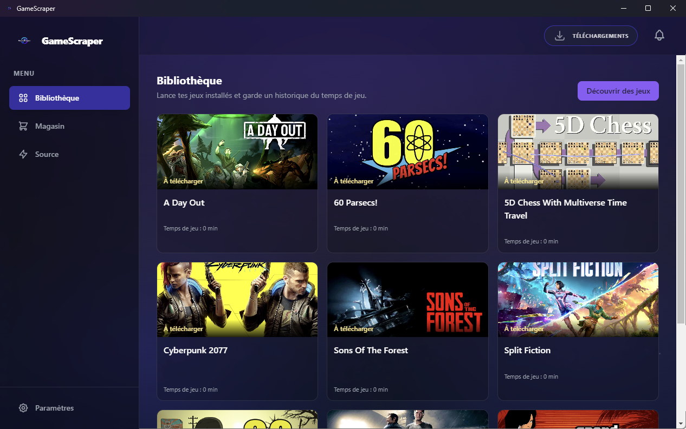
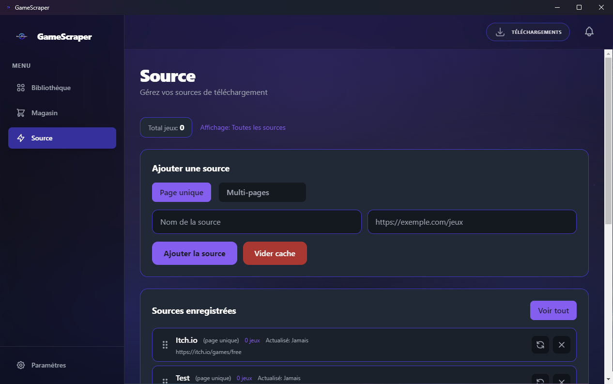

# 🎮 GameScraper

**GameScraper** est une application tout-en-un pour centraliser et automatiser votre collection de jeux vidéo. Scrapez, téléchargez et jouez en un clic.

---

## ✨ Fonctionnalités Principales

* 🚀 **Automatisation Totale :** L'application télécharge le jeu, **extrait l'archive (.zip)** et le lance directement. Plus besoin de manipuler les fichiers !
* 🕸️ **Scraping Personnalisable :** Ajoutez vos propres sources (URL) pour indexer vos jeux favoris automatiquement.
* 📚 **Bibliothèque Unifiée :** Regroupez tous vos titres dans une interface moderne et fluide.
* ⏱️ **Suivi du Temps de Jeu :** Enregistrez vos statistiques de jeu pour chaque titre.
* 🌙 **Interface Dark Mode :** Un design épuré pensé pour le confort des joueurs.
* ⚡ **Gestion du Cache :** Navigation ultra-rapide sans surcharger les sites sources.

---

## ⚠️ Avertissement Légal

**GameScraper est un outil technique neutre.** Il est conçu pour la gestion de bibliothèques de jeux légaux (freewares, open-source, sans DRM). L'utilisateur est **seul responsable** des sources qu'il ajoute. Respectez toujours les droits d'auteur et les conditions d'utilisation des sites scrapés.

---

## ⚙️ Comment ça marche ?

### 1. La Bibliothèque
Lancez vos jeux installés et suivez votre temps de jeu d'un simple coup d'œil.

### 2. Gestion des Sources
Configurez vos sites sources pour importer des catalogues entiers.

* **Page Unique :** Pour scraper une liste précise.
* **Multi-pages :** Pour parcourir des sites entiers.
* **Vider le cache :** Pour forcer une mise à jour des données.

---

## 🚀 Installation Rapide

1. Allez dans la section **Releases** de ce dépôt (en bas de page).
2. Téléchargez le fichier **`.exe`**.
3. Installez, lancez et ajoutez votre première source. **GameScraper s'occupe du reste !**

---

## 🛠️ Technologies Utilisées

* **Frontend :** Electron, React, TailwindCSS
* **Backend :** Node.js
* **Stack :** Vite, TypeScript

---

## 🤝 Contribution

N'hésitez pas à ouvrir une *Issue* ou une *Pull Request* pour améliorer l'outil !

## 📄 Licence

Ce projet est sous licence MIT.
